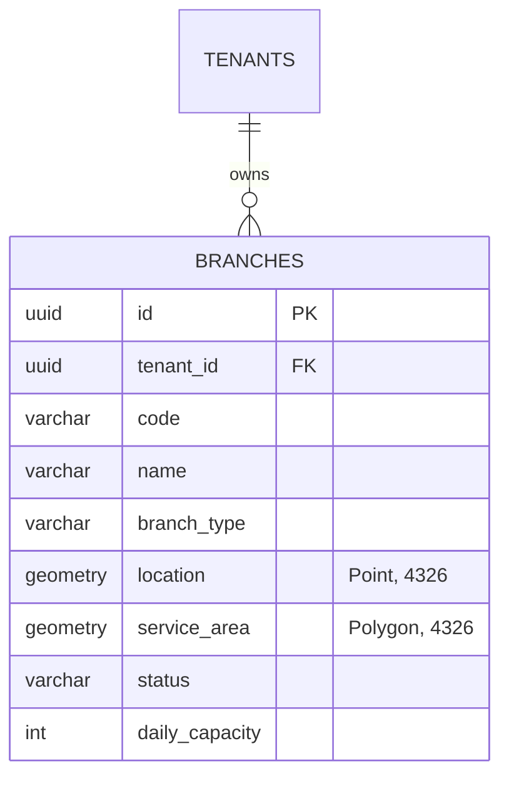

# Geospatial Serviceability Architecture

## 1. Overview
The **LogiFlows Geospatial Serviceability Engine** provides sub-millisecond, authoritative serviceability evaluation, nearest logistics hub resolution, and polygon-based delivery boundary management for multi-tenant postal and courier operations.

PostgreSQL with the **PostGIS 16** extension serves as the single source of truth for all spatial coordinates and boundary geometries.

---

## 2. Spatial Data Model (SRID 4326)

All spatial entities adhere to the **WGS 84 (World Geodetic System 1984)** geographic coordinate reference system, represented by spatial reference identifier **EPSG / SRID 4326**.



### 2.1 Branch Location (`Point`)
- Stored as `GEOMETRY(Point, 4326)`.
- Standard GIS axis order: **X = Longitude**, **Y = Latitude**.
- Stored via: `ST_SetSRID(ST_MakePoint(longitude, latitude), 4326)`.

### 2.2 Branch Service Area (`Polygon`)
- Stored as `GEOMETRY(Polygon, 4326)`.
- Represents the polygon coverage zone serviced by a particular hub or distribution center.
- Validated to ensure closed linear rings (first and last coordinate vertices match).
- Exported dynamically via `ST_AsGeoJSON(service_area)`.

---

## 3. Spatial Indices & Query Performance

Spatial queries are accelerated using **GiST (Generalized Search Tree)** indices:

```sql
CREATE INDEX idx_branches_location ON branches USING GIST (location);
CREATE INDEX idx_branches_service_area ON branches USING GIST (service_area);
CREATE INDEX idx_branches_tenant ON branches(tenant_id);
```

### 3.1 Point-in-Polygon Serviceability Resolution
When an order is created or when a customer checks serviceability for coordinates `(lat, lon)`:

```sql
SELECT id, code, name, branch_type, address, city, contact_phone, status,
       ST_Y(location) as lat, ST_X(location) as lon,
       ST_Distance(location::geography, ST_SetSRID(ST_MakePoint($2, $3), 4326)::geography) as distance_meters
FROM branches
WHERE tenant_id = $1
  AND status = 'ACTIVE'
  AND ST_Contains(service_area, ST_SetSRID(ST_MakePoint($2, $3), 4326))
ORDER BY distance_meters ASC
LIMIT 1;
```

- `ST_Contains` evaluates if the point is topologically within the branch's service polygon.
- `ST_Distance(...::geography)` calculates exact geodesic distance in meters on the WGS 84 ellipsoid.

### 3.2 Nearest Neighbor Search (KNN)
If coordinates fall outside active polygon boundaries, a K-Nearest-Neighbor query determines the closest operational facility:

```sql
SELECT id, code, name, branch_type, address, city, contact_phone, status,
       ST_Y(location) as lat, ST_X(location) as lon,
       ST_Distance(location::geography, ST_SetSRID(ST_MakePoint($2, $3), 4326)::geography) as distance_meters
FROM branches
WHERE tenant_id = $1
  AND status = 'ACTIVE'
ORDER BY location <-> ST_SetSRID(ST_MakePoint($2, $3), 4326) ASC
LIMIT 1;
```

The `<->` operator performs an index-assisted bounding-box distance sort using the GiST index.

---

## 4. Multi-Tenant Spatial Isolation

- All spatial operations mandate `tenant_id` filtering.
- Tenant A's service polygons will never match Tenant B's shipments.
- Cross-tenant service area overlap is permitted across distinct tenants without interference.

---

## 5. Branch Hierarchy & Logistics Roles

| Branch Type | Role | Typical Service Area | Daily Capacity |
| :--- | :--- | :--- | :--- |
| `SORTING_HUB` | Regional super-facility handling bulk parcel sorting, long-haul line-haul transit, and inter-city routing. | Metro / Regional | 20,000 – 100,000+ |
| `DISTRIBUTION_CENTER` | Mid-mile dispatch center connecting sorting hubs to last-mile delivery routes. | City Zone / District | 5,000 – 20,000 |
| `LOCAL_OFFICE` | Last-mile pickup & delivery point for couriers and customer drop-offs. | Local Neighborhood / Ward | 500 – 5,000 |
