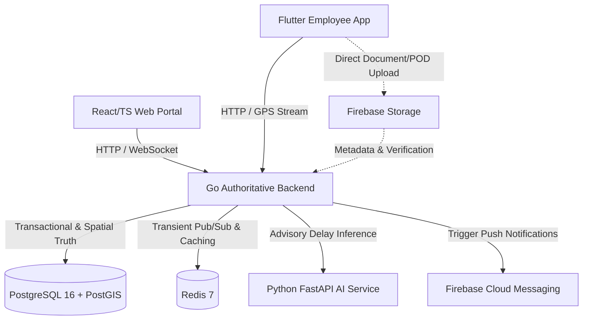

# LogiFlows — System Architecture Overview

## 1. Architectural Philosophy

LogiFlows is an enterprise-grade, multi-tenant logistics management platform engineered with clear authoritative boundaries:

---

## 2. Core Tenets

1. **Go is the Sole Operational Authority:**
   - All state transitions, role authorizations, tenant boundaries, parcel lifecycle progression, custody assignments, and pricing calculations are enforced solely within Go.
2. **PostgreSQL + PostGIS is Transactional & Geospatial Truth:**
   - No data state exists without transactional durability and spatial validation in PostgreSQL.
3. **Redis is Purely Transient:**
   - Used for live GPS telemetry caching, pub/sub fanout to WebSockets, and distributed rate limiting. Redis failure causes graceful degradation, never business state corruption.
4. **Python AI is Strictly Advisory:**
   - Generates delay probability scores and risk factors. AI output is stored by Go and cannot directly mutate state.
5. **Firebase is a Supporting Cloud Service:**
   - Provides push notifications via FCM, high-throughput media storage for Proof of Delivery (POD) photos/signatures, and auxiliary synchronization.
