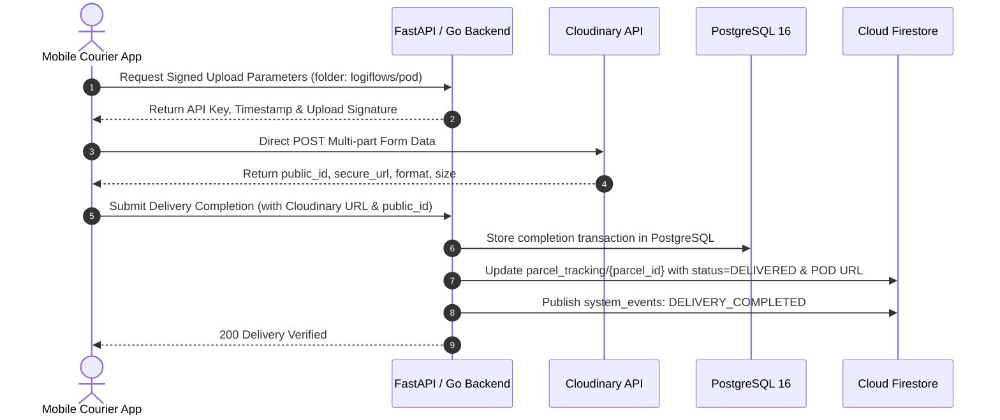

# LogiFlows — Cloudinary Storage Architecture

## 1. Architectural Mandate

**Do NOT use Firebase Storage.**
In LogiFlows, all unstructured media and files are managed exclusively through **Cloudinary**:
- **Proof of Delivery (POD) Photos**: Captured by courier cameras upon handoff.
- **Customer Signatures**: Vector or PNG signature captures.
- **Parcel Dimension Photos**: Initial intake verification at branches.
- **Employee Documents**: KYC / verification files.
- **Waybills & Shipping Labels**: PDF and image documents.

---

## 2. Storage Separation Pattern

Binary files are **never** stored directly in PostgreSQL or Cloud Firestore. Instead, the backend stores structured metadata pointers:

### Stored Metadata Schema:
```json
{
  "public_id": "pod_photos/trk_98214301_sig",
  "cloudinary_url": "https://res.cloudinary.com/logiflows-cloud/image/upload/v1728140000/pod_photos/trk_98214301_sig.png",
  "file_type": "RECIPIENT_SIGNATURE",
  "uploaded_by": "6cce643f-0323-413e-939d-344c7ba27649",
  "parcel_id": "TRK-2026-0001",
  "assignment_id": "asg_demo_101",
  "created_at": "2026-10-02T15:25:00Z"
}
```

---

## 3. Upload Flow



---

## 4. Configuration

```env
CLOUDINARY_CLOUD_NAME=logiflows-cloud
CLOUDINARY_API_KEY=your_cloudinary_api_key
CLOUDINARY_API_SECRET=your_cloudinary_api_secret
```
