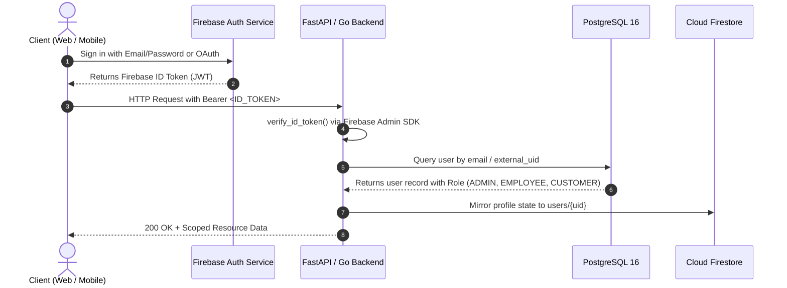

# LogiFlows — Firebase Authentication Integration

## 1. Authentication Architecture

LogiFlows implements a dual-compatible authentication model:
1. **Core JWT Authentication (Authoritative)**: Handled by the Go backend via cryptographically signed JWT access tokens (15m expiry) and UUID refresh tokens stored in PostgreSQL.
2. **Firebase Authentication Integration**: Frontends (React / Flutter) authenticate via Firebase Auth and send the Firebase ID Token to LogiFlows APIs via `Authorization: Bearer <id_token>`.

---

## 2. Authentication Flow

---

## 3. Role-Based Access Control (RBAC)

The backend never trusts roles passed directly from client payloads:
- **`CUSTOMER`**:
  - Can read own profile and notifications.
  - Can track own parcels (`parcel_tracking/{parcel_id}`).
  - Can register device token for push alerts.
- **`EMPLOYEE`**:
  - Can view assigned delivery assignments.
  - Can stream GPS locations for active assignments (`delivery_locations/{assignment_id}`).
  - Can trigger POD upload to Cloudinary and mark delivery status.
- **`ADMIN` / `PLATFORM_ADMIN`**:
  - Full operational visibility across all branches, couriers, and assignments.
  - System event auditing (`system_events/{event_id}`).
