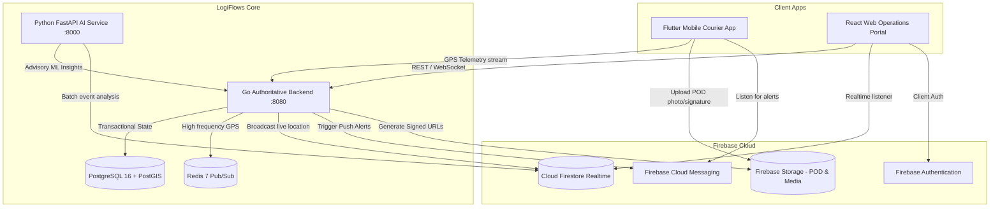

# LogiFlows — Firebase Integration Master Architecture Plan

## 1. Existing Codebase Inspection Summary

| Component | Technology | Directory | Current Role & State |
| :--- | :--- | :--- | :--- |
| **Authoritative Core Backend** | Go 1.22+ (Chi, PostGIS, JWT) | `backend/` | Authoritative owner of business state machines, RBAC, tenant isolation, PostGIS spatial serviceability, and high-throughput real-time events. |
| **AI Advisory Service** | Python 3.11+ (FastAPI, Scikit-learn) | `ai/` | Delay risk forecasting, travel time prediction, and ML feature extraction. |
| **Transactional Database** | PostgreSQL 16 + PostGIS | Docker (`5432`) | Transactional relational truth and spatial indexing. |
| **Transient Cache & Pub/Sub**| Redis 7 Alpine | Docker (`6379`) | Live telemetry caching, Pub/Sub broker, and rate limiting. |
| **Web Operations Portal** | React 18 + Vite + Tailwind | `web/` | Operations dashboard, tenant dispatch, customer booking, and monitoring. |
| **Mobile Operations App** | Flutter 3.22+ (Dart) | `mobile/` | Courier field application with QR scanning and GPS telemetry. |

---

## 2. Architectural Harmony & Conflict Resolution

### Conflict Analysis
The prompt notes Python/FastAPI as a primary backend while Go acts as the authoritative core platform in this repository. 
- **Least Disruptive Resolution:**
  1. **Dual-Ecosystem SDK Integration:** Provide official Firebase Admin SDK integration for **both** the Python service (`ai/`) and the Go Authoritative Backend (`backend/`).
  2. **Go Core Gateway:** Go retains authority over database mutations, PostGIS queries, state machines, and high-frequency WebSocket GPS tracking streams.
  3. **Python AI & Automation Service:** Python utilizes `firebase-admin` for background data enrichment, event analytics, and advisory processing.
  4. **Firestore:** Stores realtime tracking coordinates, transient status mirrors, device FCM tokens, and delivery events without duplicating PostgreSQL transactional tables.
  5. **Firebase Storage:** Stores Proof of Delivery (POD) photos, customer recipient signatures, and waybill PDFs with signed URLs.
  6. **Firebase Client SDK in React & Flutter:** Client SDKs listen to live Firestore updates and receive FCM push notifications while directing state-changing operations through authoritative backend APIs.

---

## 3. Firebase Collection & Data Architecture

### Logical Firestore Collections:
1. `users`: Profile mirror and client role cache (`uid`, `email`, `role`, `name`, `phone`, `tenant_id`).
2. `branches`: Realtime operational status of service hubs.
3. `parcel_tracking`: Lightweight user-facing live tracking mirror with checkpoints.
4. `delivery_locations`: Active courier GPS coordinates (`assignment_id`, `employee_id`, `lat`, `lng`, `speed`, `heading`, `updated_at`).
5. `notifications`: In-app notification feed for couriers, dispatchers, and customers.
6. `device_tokens`: FCM registration tokens mapped to user accounts for multi-platform delivery.
7. `system_events`: Audit stream of assignment and lifecycle transitions (`DELIVERY_ASSIGNMENT_CREATED`, `PARCEL_IN_TRANSIT`, etc.).

---

## 4. Implementation Phase Breakdown

- **Phase 1 — Foundation:** Dependencies (Python `firebase-admin`, Go `firebase.google.com/go/v4`), `.env.example`, `.gitignore`, configuration loaders, and service layers.
- **Phase 2 — Authentication:** ID token verification, dual-auth middleware (Firebase + JWT), role-based validation (`ADMIN`, `EMPLOYEE`, `CUSTOMER`).
- **Phase 3 — Firestore:** Reusable CRUD and query layer, sync pipelines for tracking, notifications, and device tokens.
- **Phase 4 — Firebase Storage:** Secure upload mechanisms, signed URLs, proof-of-delivery (POD) photo/signature management.
- **Phase 5 — Real-Time Tracking:** Mobile GPS ➜ Go tracking service / WebSocket ➜ Redis ➜ Firestore ➜ React Live Dashboard.
- **Phase 6 — Notifications:** FCM push messaging for assignments, delay warnings, and status changes alongside n8n/webhook triggers.
- **Phase 7 — Security:** Hardened `firestore.rules`, `firebase.storage.rules`, and backend token sanitization.
- **Phase 8 — Integration Testing & Documentation:** End-to-end acceptance tests, health checks, and user manuals.
