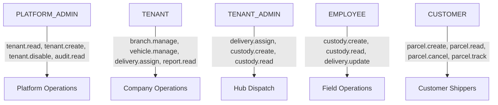

# LogiFlows — Role-Based Access Control (RBAC) Specification

## 1. Core Principles

1. **Server-Side Authority:** Roles, permissions, and tenant associations are determined solely by the Go backend. Client-supplied role claims or dropdowns are never trusted.
2. **Granular Permissions:** Endpoints are guarded by specific permissions (e.g. `parcel.create`, `tenant.disable`) rather than hardcoded role checks, enabling dynamic role composition.
3. **Auditability:** Every authentication, permission denial, or role failure generates a structured log and database audit record in `audit_logs`.

---

## 2. Authoritative Roles

| Role | Target Actor | Default Dashboard Route | Description |
| :--- | :--- | :--- | :--- |
| `PLATFORM_ADMIN` | System Operations | `/admin/dashboard` | Global platform administrator; manages tenants, platform settings, and audit logs. |
| `TENANT` | Company Owner | `/tenant/dashboard` | Logistics company organization owner; manages company branches, fleet, and tenant admins. |
| `TENANT_ADMIN` | Hub Dispatcher | `/tenant-admin/dashboard` | Branch manager / dispatch controller; manages dispatch queues, assignments, and local staff. |
| `EMPLOYEE` | Courier / Driver | `/employee/dashboard` | Field worker; executes pickup, QR scanning, GPS tracking, and Proof of Delivery. |
| `CUSTOMER` | Shipper / Recipient | `/customer/dashboard` | External customer; books shipments, generates QR identity, and tracks parcels. |

---

## 3. Authoritative Role-to-Permission Mapping

---

## 4. Enforcement Middleware

Authorization is enforced via composable Go middlewares:
- `middleware.Authenticate(cfg)`: Validates JWT signature and expiry, injects `UserClaims` into request context.
- `middleware.RequireRole(roles...)`: Rejects non-matching roles with `403 FORBIDDEN_ROLE`.
- `middleware.RequirePermission(perm)`: Rejects users lacking the specific permission with `403 PERMISSION_DENIED`.
