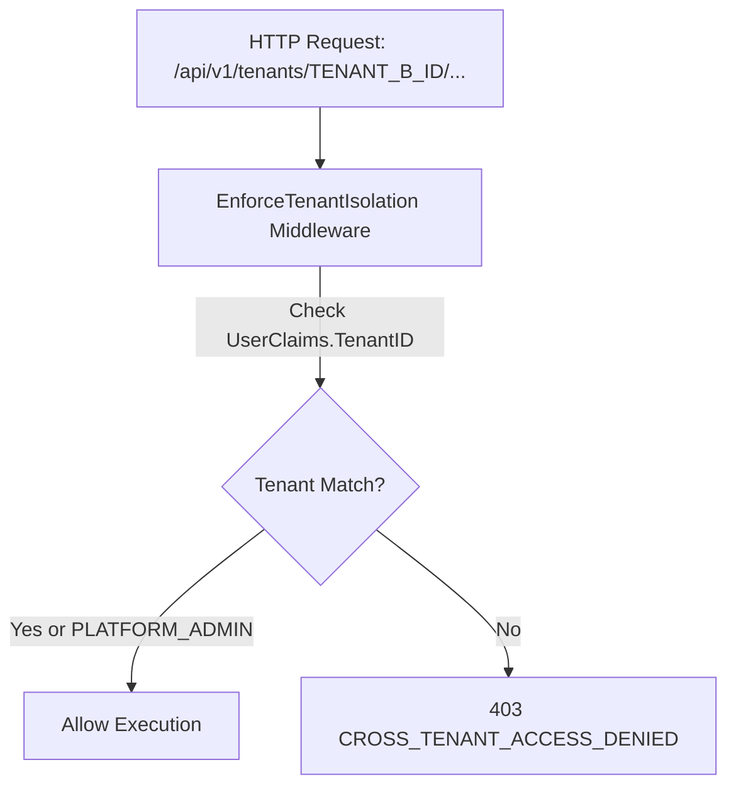

# LogiFlows — Multi-Tenancy & Tenant Isolation Specification

## 1. Multi-Tenant Philosophy

LogiFlows is engineered from the ground up as a shared-database, row-level isolated multi-tenant architecture. Every tenant-scoped entity (`branches`, `employees`, `vehicles`, `customers`, `parcels`) is bound to a `tenant_id`.

---

## 2. Insecure Direct Object Reference (IDOR) Prevention

1. **Token Claims Extraction:** The `tenant_id` is extracted strictly from the verified JWT access token, never from client request bodies or URL path parameters.
2. **Path Parameter Verification:** For routes containing `{tenant_id}`, the middleware `middleware.EnforceTenantIsolation("tenant_id")` ensures non-Platform Admin users cannot supply another company's UUID.
3. **Database Repository Boundary:** All downstream SQL queries include `WHERE tenant_id = $1` to guarantee query isolation.
